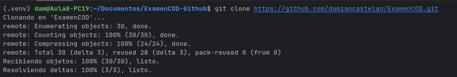
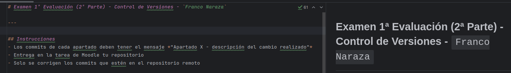
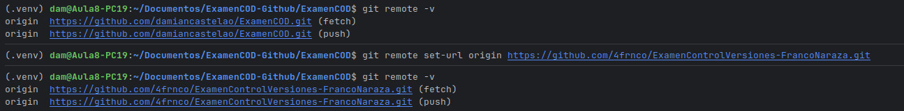
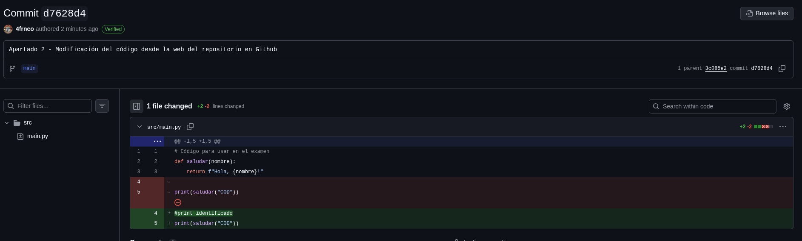
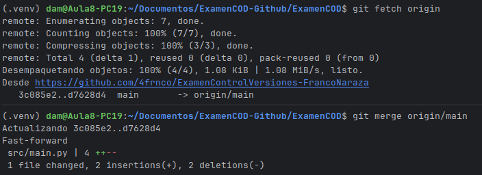

# Examen 1ª Evaluación (2ª Parte) - Control de Versiones - `Franco Naraza`

---

## Instrucciones
- Los commits de cada apartado deben tener el mensaje *"Apartado X - descripción del cambio realizado"*
- Entrega en la tarea de Moodle tu repositorio
- Solo se corrigen los commits que estén en el repositorio remoto

### Apartado 1

- Clona este repositorio.
- Modifica este Readme, poniendo tu nombre completo, realiza un `commit` con el mensaje *"Apartado 1"* y un `push`.

`Imagenes del Apartado 1:`

Clonación: 
Primera modificación del readme agregando mi nombre:

Pregunta 
- ¿Qué paso es fundamental cuando clonamos un repositorio ajeno para que podamos subir nuestros propios commits? Explícalo y utiliza capturas de pantalla.

`Respuesta a la pregunta del apartado 1:`

- El paso fundamental al clonar un repositorio ajeno para poder subir nuestros propios commits es tener permisos de escritura sobre el repositorio.

- Como el repositorio original no nos permite hacer push, en la terminal cambié el remoto al repositorio propio usando:

    git remote set-url origin https://github.com/4frnco/ExamenControlVersiones-FrancoNaraza.git

Cambio de remoto para hacer push a mi repositorio:

---
### Apartado 2

- Realiza una modificación en el código en la web de tu repositorio en GitHub
- Utiliza fetch para descargar los cambios realizados en tu repositorio.

Pregunta
- Explica los pasos para que el código modificado en GitHub, llegue a tu rama principal local. Explícalo con capturas de pantalla.

`Respuestas a la pregunta e imagenes del Apartado 2:`

Luego de lograr la modificación del codigo desde la web de Github, lo visualizamos y podremos observar que dice `verified` en verde al ver el commit desde la web:

Para que el código modificado en GitHub, llegue a mi rama principal local lo que hago es utilizar fetch y merge para descargar los cambios y poder tenerlos en local: 

---
### Apartado 3

- Realiza otro cambio desde la web de tu repositorio en GitHub.
- Utiliza pull para descargar los cambios realizados en tu repositorio.

Pregunta
- Explica los pasos dados para que el cambio realizado en GitHub, llegue a tu rama principal local. Explícalo con capturas de pantalla.

